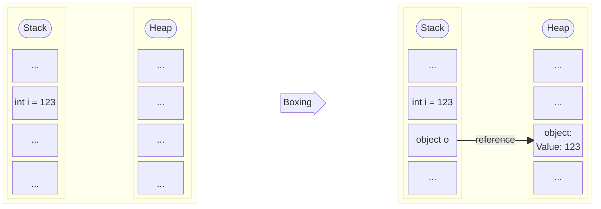

# Boxing

## Table of Contents

- [What is Boxing?](#what-is-boxing)
- [Official Microsoft Example](#official-microsoft-example)
- [Practical Examples](#practical-examples)
  - [Non-Generic Collections - ArrayList](#non-generic-collections---arraylist)
  - [Non-Generic Collections - Queue and Hashtable](#non-generic-collections---queue-and-hashtable)
- [Functions that Accept `object` as Parameter](#functions-that-accept-object-as-parameter)
  - [Console.WriteLine](#consolewriteline)
  - [Methods that Accept object](#methods-that-accept-object)
- [Override Default Methods](#override-default-methods)
  - [Struct Without Override](#struct-without-override)
  - [Struct With Override and IEquatable&lt;T&gt;](#struct-with-override-and-iequatablet)
  - [Comparisons with and without Boxing](#comparisons-with-and-without-boxing)
  - [Less Obvious Boxing Examples](#less-obvious-boxing-examples)
    - [Boxing When Retrieving from Non-Generic Collection](#boxing-when-retrieving-from-non-generic-collection)
    - [Boxing When Function Returns object](#boxing-when-function-returns-object)
    - [Boxing in Methods that Accept object](#boxing-in-methods-that-accept-object)
- [Interfaces in Structs](#interfaces-in-structs)
  - [IEquatable&lt;T&gt; - Avoids Boxing](#iequatablet---avoids-boxing)
  - [IComparable&lt;T&gt; vs IComparable](#icomparablet-vs-icomparable)
  - [Multiple Interfaces - When to Use Each](#multiple-interfaces---when-to-use-each)
  - [Boxing When Assigning Struct to Non-Generic Interface](#boxing-when-assigning-struct-to-non-generic-interface)
  - [Summary: Generic vs Non-Generic Interfaces](#summary-generic-vs-non-generic-interfaces)
- [String Interpolation](#string-interpolation)
- [Reflection](#reflection)
- [Events and Delegates](#events-and-delegates)
- [LINQ and Collection Operations](#linq-and-collection-operations)
- [Serialization](#serialization)
- [Modern Alternatives](#modern-alternatives)
  - [ValueTuple vs Tuple](#valuetuple-vs-tuple)
  - [ValueTask vs Task](#valuetask-vs-task)
- [Tips for Identifying Boxing in Code](#tips-for-identifying-boxing-in-code)
- [Summary](#summary)
- [References](#references)

---

## What is Boxing?

Boxing is the process of converting a value type to the `object` type or to any interface type implemented by that value type. Boxing conversion is implicit, while unboxing is explicit.

When boxing occurs, the value is copied from the stack (where value types are stored) to the heap (where objects are stored), creating a new instance of the `object` type that contains a copy of the original value. Due to this memory allocation and data copying, boxing and unboxing conversions are computationally expensive operations.

### Diagram: Stack and Heap

The diagram below illustrates what happens in memory during the boxing process:



**Diagram explanation:**

- **Before Boxing:** The value `123` is stored directly on the stack in variable `i`
- **After Boxing:**
  - A new object is created on the heap containing the value `123`
  - Variable `o` on the stack stores a reference (pointer) that points to this object on the heap
  - The original value on the stack remains unchanged

### Simple Visual Example

```cs
    int number = 42;           // Value type on the stack
    object obj = number;       // Boxing: copies value from stack to heap
    int newNumber = (int)obj;  // Unboxing: copies value from heap back to stack
```

**When should you worry about boxing?** In high-performance code, intensive loops, or when processing large volumes of data, boxing can become a significant bottleneck. For most applications, the impact is minimal, but it's important to understand the concept to avoid performance issues when necessary.

This tutorial covers the main scenarios where boxing occurs in real projects and how to avoid it, including non-generic collections, methods that accept `object`, interfaces, string interpolation, reflection, events, LINQ, and serialization.

## Official Microsoft Example

```cs
    int i = 123;      // a value type
    object o = i;     // boxing
    int j = (int)o;   // unboxing
```

**What happens here?**

1. `i` is a value type (`int`) stored directly on the stack with the value 123
2. `o = i` causes boxing: the value 123 is copied to the heap, creating an object that wraps it, and `o` receives a reference to that object
3. `(int)o` causes unboxing: the value is extracted from the object on the heap and copied back to the stack in variable `j`

While the official examples are good at demonstrating the concept simply, they are not very practical. This tutorial provides more practical examples that you may encounter in real projects.

## Practical Examples

Packages like `System.Collections`, which don't use Generics, end up relying on the `object` type to store references to any type. Other examples include `System.Collections.Specialized` and `System.Data`.

In these cases, especially when dealing with value types, it's preferable to use structures that use Generics, such as `System.Collections.Generic`.

> **Note on legacy code:** In some cases, you may encounter legacy code that still uses non-generic collections. If possible, refactor to use generic collections. If not possible, be aware of the boxing cost and consider optimizing only in performance-critical parts.

### Non-Generic Collections - ArrayList

```cs
    var listBoxing = new ArrayList();
    // Boxing occurs when adding the value
    listBoxing.Add(1);
    listBoxing.Add(DateTime.Now); // Boxing also occurs with other value types

    // Unboxing occurs when retrieving the value
    int inList = (int)listBoxing[0];
    
    // Less obvious example: boxing in iterations
    foreach (object item in listBoxing) // Each item is already boxed
    {
        if (item is int value) // Pattern matching causes unboxing
        {
            // Work with value
        }
    }
    
    // Solution without boxing
    var listNoBoxing = new List<int>();
    listNoBoxing.Add(1);
    int value = listNoBoxing[0]; // No boxing
```

### Non-Generic Collections - Queue and Hashtable

```cs
    var queue = new Queue();
    var hashtable = new Hashtable();
    
    // Boxing occurs when adding
    queue.Enqueue(42);
    hashtable.Add("key", 100);
    
    // Unboxing when retrieving
    int inQueue = (int)queue.Dequeue();
    int inHash = (int)hashtable["key"];
    
    // Less obvious example: methods that return object
    bool contains = hashtable.ContainsValue(100); // Boxing when passing 100
    object found = hashtable["key"]; // Already boxed
    
    // Solution without boxing
    var queueNoBoxing = new Queue<int>();
    var hashtableNoBoxing = new Dictionary<string, int>();
    queueNoBoxing.Enqueue(42);
    hashtableNoBoxing.Add("key", 100);
    int value = hashtableNoBoxing["key"]; // No boxing
```

## Functions that Accept `object` as Parameter

Another example is functions that accept `object` as a parameter, such as `Console.WriteLine` or the default `.Equals` method.

For these cases, the solution varies. For example, since we know that `Console.WriteLine` parameters will be converted to `string`, we can do the conversion in advance using the `.ToString()` method, thus preventing boxing of the value type. Since `string` is already a reference type, no boxing occurs for it.

### Console.WriteLine

The `Console.WriteLine` method accepts `object` as a parameter, so passing value types directly causes boxing. Since we know the value will be converted to string internally, we can do the conversion explicitly using `.ToString()` to avoid boxing.

```cs
    Console.WriteLine("Value {0}", 1); // With boxing - int is converted to object
    Console.WriteLine("Value {0}", 1.ToString()); // Without boxing - int.ToString() returns string (reference)
    
    // Less obvious example: formatting with multiple parameters
    int id = 42;
    float price = 99.99f;
    Console.WriteLine("ID: {0}, Price: {1}", id, price); // Both cause boxing
    
    // Solution: convert explicitly
    Console.WriteLine("ID: {0}, Price: {1}", id.ToString(), price.ToString());
```

### Methods that Accept object

```cs
    // Function that accepts object
    void ProcessValue(object value)
    {
        // Boxing already occurred when passing the parameter
        if (value is int intValue) // Unboxing here
        {
            // Process
        }
    }
    
    ProcessValue(42); // Boxing occurs in the call
    
    // Less obvious example: extension methods that accept object
    public static bool IsNumeric(this object obj)
    {
        return obj is int || obj is float || obj is double; // Boxing already occurred
    }
    
    int number = 42;
    bool result = number.IsNumeric(); // Boxing when passing as object
    
    // Solution: use generics
    void ProcessValue<T>(T value) where T : struct
    {
        // No boxing - specific type
    }
    ProcessValue(42); // No boxing
```

## Override Default Methods

For new types, it's always preferable to override the default methods `.Equals`, `.ToString`, and `.GetHashCode`. These methods cause boxing in their default implementations and are heavily used by libraries and data structures.

### Struct Without Override

When a struct doesn't override the default methods, all calls to these methods cause boxing, since the base implementation receives `object` as a parameter.

```cs
    public struct DataWithoutSpecializedOverride
    {
        public int Id;
        public float Velocity;
    }

    var dataWithoutOverride = new DataWithoutSpecializedOverride { Id = 1, Velocity = 10.5f };
    Console.WriteLine("Value {0}", dataWithoutOverride); // Boxing: struct converted to object
    Console.WriteLine("Value {0}", dataWithoutOverride.ToString()); // Boxing: base.ToString() receives object
    
    // Less obvious example: use in generic collections still causes boxing
    var dict = new Dictionary<object, string>();
    dict[dataWithoutOverride] = "test"; // Boxing when using as key
```

**Performance Impact:** In loops that process thousands of instances, each call to `ToString()` or `Equals()` without an override causes boxing, resulting in unnecessary heap allocations and increased pressure on the garbage collector.

### Struct With Override and IEquatable&lt;T&gt;

```cs
    public struct DataWithSpecializedOverride : IEquatable<DataWithSpecializedOverride>
    {
        public int Id;
        public float Velocity;

        // IEquatable<T> implementation - does not cause boxing
        public bool Equals(DataWithSpecializedOverride other) => 
            Id == other.Id && Math.Abs(Velocity - other.Velocity) < float.Epsilon;

        // Override necessary for compatibility
        public override bool Equals(object obj) => 
            obj is DataWithSpecializedOverride other && Equals(other);

        public override int GetHashCode() => HashCode.Combine(Id, Velocity);

        public override string ToString() => $"[Id:{Id}, Velocity:{Velocity}]";
    }

    var dataWithOverride = new DataWithSpecializedOverride();
    Console.WriteLine("Value {0}", dataWithOverride.ToString()); // No boxing
```

### Comparisons with and without Boxing

```cs
    var dataWithOverride1 = new DataWithSpecializedOverride { Id = 1, Velocity = 10.5f };
    var dataWithOverride2 = new DataWithSpecializedOverride { Id = 1, Velocity = 10.5f };
    
    dataWithOverride1.Equals(dataWithOverride2); // No boxing - uses IEquatable<T>
    dataWithOverride1.Equals((object)dataWithOverride2); // With boxing - uses object.Equals override
```

### Less Obvious Boxing Examples

#### Boxing When Retrieving from Non-Generic Collection

```cs
    var dataWithoutOverride = new DataWithoutSpecializedOverride { Id = 1, Velocity = 10.5f };
    var arrayList = new ArrayList { dataWithoutOverride };
    var itemFromList = arrayList[0]; // itemFromList is object - boxing already occurred when adding
    dataWithoutOverride.Equals(itemFromList); // Additional boxing when passing to Equals
    
    // Example: iteration causes multiple boxing
    foreach (var item in arrayList) // var will be of type object
    {
        if (dataWithoutOverride.Equals(item)) // Boxing in each iteration
        {
            // Process
        }
    }
```

#### Boxing When Function Returns object

```cs
    var dataWithOverride = new DataWithSpecializedOverride { Id = 1, Velocity = 10.5f };
    
    object GetDataAsObject() => new DataWithSpecializedOverride { Id = 2, Velocity = 20.0f };
    var dataFromFunction = GetDataAsObject(); // Boxing occurs on return
    dataWithOverride.Equals(dataFromFunction); // Boxing when passing to Equals
    
    // Less obvious example: API methods that return object
    object GetFromDatabase(int id)
    {
        return new DataWithSpecializedOverride { Id = id, Velocity = 0f };
    }
    var dbData = GetFromDatabase(1);
    dataWithOverride.Equals(dbData); // Boxing
```

#### Boxing in Methods that Accept object

```cs
    var dataWithOverride = new DataWithSpecializedOverride { Id = 1, Velocity = 10.5f };
    var arrayList = new ArrayList { dataWithOverride };
    arrayList.Contains(dataWithOverride); // Boxing when passing as object and in each comparison
    
    // Example: validation methods
    bool Validate(object value)
    {
        return value is DataWithSpecializedOverride data && data.Id > 0;
    }
    Validate(dataWithOverride); // Boxing in the call
```

## Interfaces in Structs

When implementing interfaces in structs, it's crucial to understand when boxing occurs. Generic interfaces like `IEquatable<T>` and `IComparable<T>` avoid boxing, while non-generic interfaces like `IComparable` cause boxing.

### IEquatable&lt;T&gt; - Avoids Boxing

The `IEquatable<T>` interface provides a strongly-typed `Equals` method that does not cause boxing:

```cs
    public struct Point : IEquatable<Point>
    {
        public int X { get; set; }
        public int Y { get; set; }

        // IEquatable<T> implementation - NO boxing
        public bool Equals(Point other) => X == other.X && Y == other.Y;

        // Override necessary for compatibility - may cause boxing
        public override bool Equals(object obj) => obj is Point other && Equals(other);

        public override int GetHashCode() => HashCode.Combine(X, Y);
    }

    var p1 = new Point { X = 1, Y = 2 };
    var p2 = new Point { X = 1, Y = 2 };
    
    p1.Equals(p2); // No boxing - uses IEquatable<Point>.Equals
    p1.Equals((object)p2); // With boxing - uses object.Equals
    
    // Less obvious example: use in HashSet/Dictionary
    var hashSet = new HashSet<Point>();
    hashSet.Add(p1); // No boxing - uses IEquatable<T>
    bool contains = hashSet.Contains(p2); // No boxing
    
    // But if using as object...
    var hashSetObject = new HashSet<object>();
    hashSetObject.Add(p1); // Boxing occurs here!
    bool containsObject = hashSetObject.Contains(p2); // Additional boxing
```

### IComparable&lt;T&gt; vs IComparable

The difference between the generic and non-generic versions is significant in terms of boxing:

```cs
    public struct Temperature : IComparable<Temperature>, IComparable
    {
        public double Celsius { get; set; }

        // IComparable<T> - NO boxing
        public int CompareTo(Temperature other) => Celsius.CompareTo(other.Celsius);

        // IComparable - WITH boxing (parameter is object)
        int IComparable.CompareTo(object obj)
        {
            if (obj is Temperature other)
                return CompareTo(other);
            throw new ArgumentException("Object is not a Temperature");
        }
    }

    var temp1 = new Temperature { Celsius = 25.0 };
    var temp2 = new Temperature { Celsius = 30.0 };
    
    // No boxing - uses IComparable<T>
    temp1.CompareTo(temp2);
    
    // With boxing - converts temp1 to IComparable (boxing)
    IComparable comparable = temp1;
    comparable.CompareTo(temp2); // Additional boxing when passing temp2 as object
    
    // Less obvious example: Array.Sort with non-generic IComparer
    var temps = new[] { temp1, temp2 };
    Array.Sort(temps); // No boxing - uses IComparable<T>
    
    // But with non-generic IComparer...
    IComparer comparer = Comparer.Default;
    Array.Sort(temps, comparer); // Boxing in each comparison!
```

### Multiple Interfaces - When to Use Each

```cs
    public struct Product : IEquatable<Product>, IComparable<Product>
    {
        public int Id { get; set; }
        public decimal Price { get; set; }

        // IEquatable<T> - for equality comparisons without boxing
        public bool Equals(Product other) => Id == other.Id;
        public override bool Equals(object obj) => obj is Product other && Equals(other);
        public override int GetHashCode() => Id.GetHashCode();

        // IComparable<T> - for sorting without boxing
        public int CompareTo(Product other) => Price.CompareTo(other.Price);
    }

    var products = new List<Product>
    {
        new Product { Id = 1, Price = 10.0m },
        new Product { Id = 2, Price = 5.0m },
        new Product { Id = 3, Price = 15.0m }
    };

    // No boxing - uses IComparable<Product>
    products.Sort(); // Sorts by price without boxing
    
    // No boxing - uses IEquatable<Product>
    var product1 = products[0];
    var product2 = products[1];
    bool areEqual = product1.Equals(product2);
    
    // Less obvious example: LINQ with OrderBy uses IComparable<T> without boxing
    var sorted = products.OrderBy(p => p).ToList(); // No boxing
    
    // But if using as object...
    var sortedByObject = products.Cast<object>().OrderBy(p => p).ToList(); // Boxing!
```

### Boxing When Assigning Struct to Non-Generic Interface

```cs
    public struct Counter : IComparable
    {
        public int Value { get; set; }

        public int CompareTo(object obj) // Object parameter causes boxing
        {
            if (obj is Counter other)
                return Value.CompareTo(other.Value);
            throw new ArgumentException();
        }
    }

    var counter1 = new Counter { Value = 10 };
    var counter2 = new Counter { Value = 20 };
    
    // Boxing occurs when assigning struct to non-generic interface
    IComparable comp = counter1; // Boxing here!
    comp.CompareTo(counter2); // Additional boxing when passing counter2 as object
    
    // No boxing - direct call (but still has boxing in CompareTo)
    counter1.CompareTo(counter2); // Boxing inside the CompareTo method
    
    // Less obvious example: passing to methods that accept IComparable
    void SortArray(IComparable[] items)
    {
        Array.Sort(items); // Boxing in each comparison
    }
    var counters = new[] { counter1, counter2 };
    SortArray(counters); // Boxing when converting array to IComparable[]
```

### Summary: Generic vs Non-Generic Interfaces

| Interface | Boxing? | When to Use |
| --------- | ------ | ----------- |
| `IEquatable<T>` | ❌ No | Whenever possible for comparisons |
| `IComparable<T>` | ❌ No | Whenever possible for sorting |
| `IEquatable` | ❌ Does not exist | - |
| `IComparable` | ✅ Yes | Avoid - use `IComparable<T>` |

**General rule:** Always prefer generic interfaces (`IEquatable<T>`, `IComparable<T>`) over non-generic ones to avoid boxing in structs.

## String Interpolation

String interpolation with `$""` can cause boxing when value types are interpolated directly. The C# compiler converts values to `object` internally before formatting them. To avoid this, explicitly convert to string using `.ToString()`.

> **Note:** Recent versions of the C# compiler (including C# 10+ with `InterpolatedStringHandler`) may optimize some string interpolation cases, reducing allocations. However, boxing can still occur when value types are passed directly in interpolation. For high-performance code, it's recommended to be explicit and use `.ToString()` to ensure no boxing occurs.

```cs
    int value = 42;
    float speed = 10.5f;
    
    // Boxing occurs - compiler converts to object internally
    string withBoxing = $"Value: {value}, Speed: {speed}";
    
    // Without boxing - explicit conversion to string
    string withoutBoxing = $"Value: {value.ToString()}, Speed: {speed.ToString()}";
    
    // Less obvious example: formatting with alignment
    string formatted = $"|{value,10}|{speed,10}|"; // Boxing in both
    
    // Example: interpolation in loops
    var numbers = new[] { 1, 2, 3, 4, 5 };
    foreach (int num in numbers)
    {
        Console.WriteLine($"Number: {num}"); // Boxing in each iteration
    }
    
    // Solution: convert before the loop
    foreach (int num in numbers)
    {
        string numStr = num.ToString();
        Console.WriteLine($"Number: {numStr}"); // No boxing
    }
```

> **Performance Note:** Benchmark results show that using `.ToString()` explicitly (avoiding boxing) is generally faster than direct interpolation (with boxing), even though it may create intermediate string objects. The performance benefit of avoiding boxing overhead outweighs the memory cost of intermediate allocations in most scenarios. For high-performance code, always prefer explicit `.ToString()` calls.

## Reflection

Reflection methods like `GetType()` on value types cause boxing, as they return `Type`, which is a reference type. Reflection is necessary when you need to inspect types at runtime, but should be used with caution in high-performance code.

**When to use reflection:** Working with metadata, attributes, dynamic serialization, dependency injection frameworks, etc.

```cs
    int number = 42;
    
    // Boxing occurs - GetType() is called on a value type
    Type type = number.GetType();
    
    // Alternative without boxing - use typeof for known types
    Type typeWithoutBoxing = typeof(int);
    
    // Less obvious example: reflection in generic methods
    void ProcessValue<T>(T value) where T : struct
    {
        Type t = value.GetType(); // Boxing here!
        // Better: typeof(T)
        Type tWithoutBoxing = typeof(T); // No boxing
    }
    
    // Example: use in attributes and metadata
    var attribute = typeof(int).GetCustomAttributes(false); // No boxing
    var attribute2 = number.GetType().GetCustomAttributes(false); // Boxing in GetType()
```

## Events and Delegates

When passing value types as `object` in events or delegates, boxing occurs. The solution is to use generics: by specifying the exact type (`EventHandler<int>` instead of `EventHandler<object>`), the compiler avoids boxing because there's no need to convert the value type to `object`.

```cs
    public event EventHandler<object> ValueChanged;
    
    public void NotifyChange(int newValue)
    {
        // Boxing occurs - int is converted to object
        ValueChanged?.Invoke(this, newValue);
    }
    
    // Solution: use generics to avoid boxing
    public event EventHandler<int> ValueChangedTyped;
    
    public void NotifyChangeTyped(int newValue)
    {
        // No boxing - specific type
        ValueChangedTyped?.Invoke(this, newValue);
    }
    
    // Less obvious example: Action<object> and Func<object, T>
    Action<object> action = obj => Console.WriteLine(obj);
    action(42); // Boxing in the call
    
    Func<object, int> func = obj => (int)obj; // Unboxing in the return
    int result = func(42); // Boxing on input, unboxing on output
    
    // Solution: typed delegates
    Action<int> actionTyped = val => Console.WriteLine(val);
    actionTyped(42); // No boxing
    
    Func<int, int> funcTyped = val => val * 2;
    int resultTyped = funcTyped(42); // No boxing
```

## LINQ and Collection Operations

LINQ operations involving value types can cause boxing, especially when methods accept `object` or when you explicitly convert to `object` using `Cast<object>()`. Most generic LINQ methods (`Where<T>`, `Select<T>`, etc.) don't cause boxing when used correctly.

```cs
    // Struct without IEquatable<T> or IComparable<T> implementation
    public struct Coordinate
    {
        public int X { get; set; }
        public int Y { get; set; }
    }
    
    var coordinates = new List<Coordinate>
    {
        new Coordinate { X = 1, Y = 2 },
        new Coordinate { X = 3, Y = 4 },
        new Coordinate { X = 1, Y = 2 }
    };
    
    // Less obvious example: Distinct() uses Equals(object) - causes boxing
    var distinctWithBoxing = coordinates.Distinct().ToList(); // Boxing in each comparison
    
    // Solution: implement IEquatable<Coordinate> and use custom comparer
    var distinctWithoutBoxing = coordinates.Distinct(new CoordinateEqualityComparer()).ToList();
    
    // Less obvious example: Contains() uses Equals(object) - causes boxing
    var coordinate = new Coordinate { X = 1, Y = 2 };
    bool containsWithBoxing = coordinates.Contains(coordinate); // Boxing in comparison
    
    // Solution: use Any with IEquatable<T> if implemented
    // bool containsWithoutBoxing = coordinates.Any(c => c.Equals(coordinate)); // If Coordinate implements IEquatable<Coordinate>
    
    // Less obvious example: OrderBy() without IComparable<T> uses Comparer.Default - causes boxing
    var sortedWithBoxing = coordinates.OrderBy(c => c).ToList(); // Boxing if there's no IComparable<T>
    
    // Solution: use IComparable<T> or custom comparer
    var sortedWithoutBoxing = coordinates.OrderBy(c => c.X).ToList(); // No boxing - sorts by property
    
    // Less obvious example: GroupBy() uses GetHashCode() and Equals(object) - causes boxing
    var groupsWithBoxing = coordinates.GroupBy(c => c).ToList(); // Boxing in GetHashCode and Equals
    
    // Solution: group by specific property
    var groupsWithoutBoxing = coordinates.GroupBy(c => c.X).ToList(); // No boxing
    
    // Less obvious example: ToDictionary() uses GetHashCode() and Equals(object) as key - causes boxing
    var dictWithBoxing = coordinates.ToDictionary(c => c, c => $"({c.X}, {c.Y})"); // Boxing in key
    
    // Solution: use tuple or property as key
    var dictWithoutBoxing = coordinates.ToDictionary(c => (c.X, c.Y), c => $"({c.X}, {c.Y})");
    
    // Less obvious example: Except() uses Equals(object) - causes boxing
    var others = new List<Coordinate> { new Coordinate { X = 1, Y = 2 } };
    var differentWithBoxing = coordinates.Except(others).ToList(); // Boxing in each comparison
    
    // Solution: use custom comparer
    var differentWithoutBoxing = coordinates.Except(others, new CoordinateEqualityComparer()).ToList();
    
    // Custom comparer to avoid boxing
    public class CoordinateEqualityComparer : IEqualityComparer<Coordinate>
    {
        public bool Equals(Coordinate x, Coordinate y) => x.X == y.X && x.Y == y.Y; // No boxing
        public int GetHashCode(Coordinate obj) => HashCode.Combine(obj.X, obj.Y); // No boxing
    }
```

## Serialization

Serializers that work with `object` can cause boxing. Use generic types when possible. Most modern serializers (System.Text.Json, Newtonsoft.Json) support generic types and avoid boxing when you specify the type explicitly.

```cs
    using System.Text.Json;
    
    int value = 42;
    
    // Boxing occurs when serializing as object
    string jsonWithBoxing = JsonSerializer.Serialize((object)value);
    
    // Without boxing - serialize the type directly
    string jsonWithoutBoxing = JsonSerializer.Serialize(value);
    
    // In collections, use generic types
    var listWithBoxing = new ArrayList { 1, 2, 3 }; // Boxing when adding
    var listWithoutBoxing = new List<int> { 1, 2, 3 }; // No boxing
    
    // Less obvious example: serialization of anonymous objects
    var anonymousObj = new { Id = 42, Name = "Test" };
    string jsonAnonymous = JsonSerializer.Serialize(anonymousObj); // No boxing (properties are references)
    
    // But if using struct...
    var structData = new { Value = 42 }; // int inside anonymous object
    string jsonStruct = JsonSerializer.Serialize(structData); // No direct boxing, but be careful with properties
    
    // Example: dictionary serialization
    var dictWithBoxing = new Dictionary<string, object> { ["key"] = 42 }; // Boxing in value
    var dictWithoutBoxing = new Dictionary<string, int> { ["key"] = 42 }; // No boxing
    
    // Example with Newtonsoft.Json
    using Newtonsoft.Json;
    string jsonWithBoxingNewtonsoft = JsonConvert.SerializeObject((object)42); // Boxing
    string jsonWithoutBoxingNewtonsoft = JsonConvert.SerializeObject(42); // No boxing
    
    // Example with XML (System.Xml.Serialization)
    // XML serialization can also cause boxing if using object
    var xmlSerializer = new System.Xml.Serialization.XmlSerializer(typeof(int));
    // Using specific types avoids boxing
```

## Modern Alternatives

C# offers modern alternatives that avoid boxing and improve performance. Two of the most important are `ValueTuple` (instead of `Tuple`) and `ValueTask` (instead of `Task`).

### ValueTuple vs Tuple

`Tuple` is a class (reference type) that causes boxing when storing value types. `ValueTuple` is a struct (value type) that avoids boxing and unnecessary allocations.

```cs
    // Tuple (class) - causes boxing and heap allocations
    Tuple<int, string> tupleWithBoxing = Tuple.Create(42, "test");
    // Boxing occurs when storing int in Tuple class
    
    // ValueTuple (struct) - no boxing, stack allocation
    (int, string) valueTupleWithoutBoxing = (42, "test");
    // No boxing - value types stored directly in struct
    
    // Example: returning multiple values
    // With Tuple - boxing and heap allocation
    Tuple<int, float> GetDataWithBoxing()
    {
        int id = 42;
        float velocity = 10.5f;
        return Tuple.Create(id, velocity); // Boxing when creating Tuple
    }
    
    // With ValueTuple - no boxing, stack allocation
    (int, float) GetDataWithoutBoxing()
    {
        int id = 42;
        float velocity = 10.5f;
        return (id, velocity); // No boxing
    }
    
    // Example: using in collections
    var listWithBoxing = new List<Tuple<int, string>>();
    listWithBoxing.Add(Tuple.Create(1, "a")); // Boxing when creating Tuple
    
    var listWithoutBoxing = new List<(int, string)>();
    listWithoutBoxing.Add((1, "a")); // No boxing
    
    // Example: deconstruction
    var tuple = Tuple.Create(42, "test");
    var (id, name) = tuple; // Boxing already occurred when creating tuple
    
    var valueTuple = (42, "test");
    var (id2, name2) = valueTuple; // No boxing
    
    // Example: passing as parameter
    void ProcessTuple(Tuple<int, string> tuple) { } // Boxing when passing
    void ProcessValueTuple((int, string) valueTuple) { } // No boxing
    
    // Example: using as key in Dictionary
    var dictWithBoxing = new Dictionary<Tuple<int, int>, string>();
    dictWithBoxing[Tuple.Create(1, 2)] = "value"; // Boxing when creating Tuple
    
    var dictWithoutBoxing = new Dictionary<(int, int), string>();
    dictWithoutBoxing[(1, 2)] = "value"; // No boxing
```

**Summary:**

- **`Tuple`**: Class, causes boxing, allocates on heap, slower
- **`ValueTuple`**: Struct, no boxing, allocates on stack, faster
- **Recommendation**: Always use `ValueTuple` (syntax `(int, string)`) instead of `Tuple` for better performance

### ValueTask vs Task

`Task` is a class that always allocates on the heap, even when the result is already available. `ValueTask` is a struct that can avoid allocations when the result is synchronous or already available.

```cs
    using System.Threading.Tasks;
    
    // Task (class) - always allocates on heap
    Task<int> GetDataWithAllocation()
    {
        int result = 42;
        return Task.FromResult(result); // Allocates Task on heap, even with ready result
    }
    
    // ValueTask (struct) - avoids allocation when result is already available
    ValueTask<int> GetDataWithoutAllocation()
    {
        int result = 42;
        return new ValueTask<int>(result); // No allocation - struct on stack
    }
    
    // Example: async method that can return synchronous result
    async Task<int> ProcessWithTask()
    {
        // If result is already available, still allocates Task
        if (cache.TryGetValue(key, out var value))
            return value; // Allocates Task even with ready result
        
        return await SomeAsyncOperation(); // Allocates Task
    }
    
    async ValueTask<int> ProcessWithValueTask()
    {
        // If result is already available, no allocation
        if (cache.TryGetValue(key, out var value))
            return value; // No allocation - returns ValueTask struct
        
        return await SomeAsyncOperation(); // May allocate Task internally if necessary
    }
    
    // Example: operations that frequently complete synchronously
    ValueTask<string> ReadStringAsync()
    {
        // If data is already in buffer, returns without allocation
        if (buffer.Length > 0)
            return new ValueTask<string>(buffer.ToString()); // No allocation
        
        // Otherwise, delegates to real async operation
        return new ValueTask<string>(ReadStringAsyncInternal());
    }
    
    // Example: using in loops
    var tasksWithAllocation = new List<Task<int>>();
    for (int i = 0; i < 1000; i++)
    {
        tasksWithAllocation.Add(GetDataWithAllocation()); // 1000 heap allocations
    }
    
    var valueTasksWithoutAllocation = new List<ValueTask<int>>();
    for (int i = 0; i < 1000; i++)
    {
        valueTasksWithoutAllocation.Add(GetDataWithoutAllocation()); // No allocations (structs on stack)
    }
    
    // Example: await works equally
    int result1 = await GetDataWithAllocation(); // Works
    int result2 = await GetDataWithoutAllocation(); // Works equally
```

**Summary:**

- **`Task`**: Always allocates on heap, even with synchronous result
- **`ValueTask`**: Avoids allocation when result is already available, may allocate `Task` internally when necessary
- **Recommendation**: Use `ValueTask` when the method frequently returns synchronous or already available results (cache, validation, etc.). Use `Task` for operations that are always asynchronous.

> **Note:** `ValueTask` should not be used in loops with multiple `await` calls. If you need to await the same `ValueTask` more than once, convert to `Task` first using `.AsTask()`.

## Tips for Identifying Boxing in Code

### Profiling Tools

1. **dotMemory (JetBrains):** Identifies boxing allocations in real-time during execution
2. **PerfView (Microsoft):** Analyzes GC events and allocations, including boxing
3. **Visual Studio Diagnostic Tools:** Integrated profiler that shows allocations and performance hotspots
4. **BenchmarkDotNet:** Useful for measuring the performance impact of different approaches

### Static Analysis

1. **Analyze IL:** Use `ildasm` or `ILSpy` to see the generated IL code and identify calls to `box`

   ```bash
   # Example: compile and analyze
   csc Program.cs
   ildasm Program.exe
   # Look for "box" instructions in IL
   ```

2. **Code analyzers:** Some analyzers can detect patterns that cause boxing

### Common Patterns to Watch

1. **Implicit conversions:** Any conversion from value type to `object` or interface causes boxing

   ```cs
   int x = 42;
   object o = x; // Boxing!
   IComparable comp = x; // Boxing!
   ```

2. **Non-generic collections:** `ArrayList`, `Hashtable`, `Queue` (non-generic) cause boxing

   ```cs
   var list = new ArrayList();
   list.Add(42); // Boxing!
   ```

3. **Methods that accept object:** Check method signatures

   ```cs
   void Process(object value) { } // May cause boxing
   Process(42); // Boxing!
   ```

4. **String interpolation without .ToString():** `$"{value}"` may cause boxing

   ```cs
   int x = 42;
   string s = $"{x}"; // Possible boxing
   string s2 = $"{x.ToString()}"; // No boxing
   ```

### Best Practices

1. **Prefer Generics:** Whenever possible, use generic collections and methods instead of non-generic versions
2. **Implement typed interfaces:** Use `IEquatable<T>` and `IComparable<T>` instead of `IComparable` when possible
3. **Override default methods:** Implement `ToString()`, `Equals()`, and `GetHashCode()` in structs
4. **Use specific types in events/delegates:** Use `EventHandler<int>` instead of `EventHandler<object>`

## Summary

Boxing is an expensive operation that should be avoided in high-performance code. The main strategies are:

- **Collections:** Use generic collections (`List<T>`, `Dictionary<TKey, TValue>`) instead of non-generic ones
- **Interfaces:** Implement `IEquatable<T>` and other typed interfaces to avoid boxing in comparisons
- **Override methods:** Override default methods (`Equals`, `ToString`, `GetHashCode`) in structs
- **String conversion:** Explicitly convert to string when necessary (`.ToString()`)
- **Events/Delegates:** Use specific types in events, delegates, and serialization
- **LINQ:** In operations with structs, use custom comparers (`IEqualityComparer<T>`, `IComparer<T>`) or implement `IEquatable<T>` and `IComparable<T>` to avoid boxing in `Distinct()`, `Contains()`, `OrderBy()`, `GroupBy()`, `ToDictionary()`, `Except()`, and similar operations
- **Reflection:** Use `typeof(T)` when the type is known at compile time

### When to Worry

You should worry about boxing and focus on avoiding it when:

- Loops that process thousands or millions of items
- Code executed frequently (hot paths)
- Applications with low latency requirements
- Systems with memory constraints (embedded, IoT)

For most applications, especially those that don't process large volumes of data or don't have high-performance requirements, boxing is rarely a problem and doesn't require optimization.

## References

### Official Documentation

- [Boxing and Unboxing (Microsoft Learn)](https://learn.microsoft.com/en-us/dotnet/csharp/programming-guide/types/boxing-and-unboxing) - Complete guide on boxing and unboxing in C#
- [Value Types (Microsoft Learn)](https://learn.microsoft.com/en-us/dotnet/csharp/language-reference/builtin-types/value-types) - Documentation on value types in C#
- [Reference Types (Microsoft Learn)](https://learn.microsoft.com/en-us/dotnet/csharp/language-reference/keywords/reference-types) - Documentation on reference types in C#
- [Generic Interfaces (Microsoft Learn)](https://learn.microsoft.com/en-us/dotnet/csharp/programming-guide/generics/) - Guide on generic programming in C#

### Language Specification

- [C# Language Specification](https://learn.microsoft.com/en-us/dotnet/csharp/language-reference/language-specification/) - Official C# language specification document
