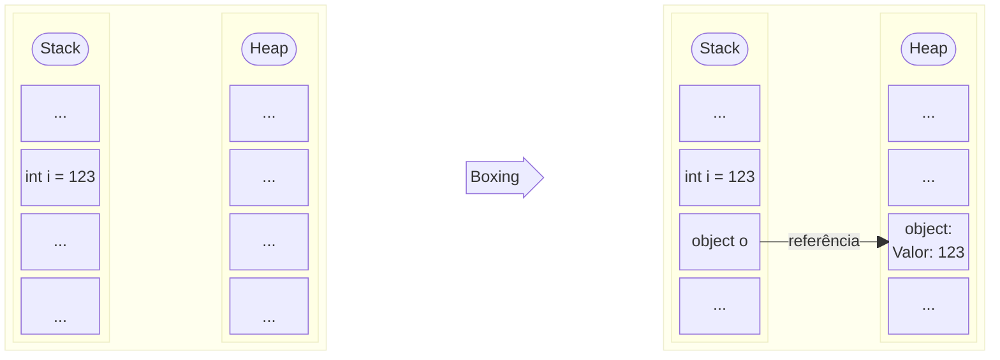

# Boxing

## Índice

- [O que é Boxing?](#o-que-é-boxing)
- [Exemplo do site oficial da Microsoft](#exemplo-do-site-oficial-da-microsoft)
- [Exemplos Práticos](#exemplos-práticos)
  - [Collections Não Genéricas - ArrayList](#collections-não-genéricas---arraylist)
  - [Collections Não Genéricas - Queue e Hashtable](#collections-não-genéricas---queue-e-hashtable)
- [Funções que Aceitam `object` como Parâmetro](#funções-que-aceitam-object-como-parâmetro)
  - [Console.WriteLine](#consolewriteline)
  - [Métodos que Aceitam object](#métodos-que-aceitam-object)
- [Override de Métodos Padrão](#override-de-métodos-padrão)
  - [Struct Sem Override](#struct-sem-override)
  - [Struct Com Override e IEquatable&lt;T&gt;](#struct-com-override-e-iequatablet)
  - [Comparações com e sem Boxing](#comparações-com-e-sem-boxing)
  - [Exemplos Menos Óbvios de Boxing](#exemplos-menos-óbvios-de-boxing)
    - [Boxing ao Recuperar de Collection Não Genérica](#boxing-ao-recuperar-de-collection-não-genérica)
    - [Boxing Quando Função Retorna object](#boxing-quando-função-retorna-object)
    - [Boxing em Métodos que Aceitam object](#boxing-em-métodos-que-aceitam-object)
- [Interfaces em Structs](#interfaces-em-structs)
  - [IEquatable&lt;T&gt; - Evita Boxing](#iequatablet---evita-boxing)
  - [IComparable&lt;T&gt; vs IComparable](#icomparablet-vs-icomparable)
  - [Múltiplas Interfaces - Quando Usar Cada Uma](#múltiplas-interfaces---quando-usar-cada-uma)
  - [Boxing ao Atribuir Struct a Interface Não Genérica](#boxing-ao-atribuir-struct-a-interface-não-genérica)
  - [Resumo: Interfaces Genéricas vs Não Genéricas](#resumo-interfaces-genéricas-vs-não-genéricas)
- [String Interpolation](#string-interpolation)
- [Reflection](#reflection)
- [Eventos e Delegates](#eventos-e-delegates)
- [LINQ e Operações com Collections](#linq-e-operações-com-collections)
- [Serialização](#serialização)
- [Dicas para Identificar Boxing no Código](#dicas-para-identificar-boxing-no-código)
- [Resumo](#resumo)
- [Referências](#referências)

---

## O que é Boxing?

Boxing é o processo de conversão de um tipo de valor para o tipo `object` ou para qualquer tipo de interface implementada por esse tipo de valor. A conversão boxing é implícita, enquanto o unboxing é explícito.

Quando ocorre boxing, o valor é copiado da stack (onde tipos de valor são armazenados) para o heap (onde objetos são armazenados), criando uma nova instância do tipo `object` que contém uma cópia do valor original. Devido a essa alocação de memória e cópia de dados, as conversões boxing e unboxing são processos computacionalmente dispendiosos.

### Diagrama: Stack e Heap

O diagrama abaixo ilustra o que acontece na memória durante o processo de boxing:



**Explicação do diagrama:**

- **Antes do Boxing:** O valor `123` está armazenado diretamente na stack na variável `i`
- **Depois do Boxing:**
  - Um novo objeto é criado no heap contendo o valor `123`
  - A variável `o` na stack armazena uma referência (ponteiro) que aponta para esse objeto no heap
  - O valor original na stack permanece inalterado

### Exemplo Visual Simples

```cs
    int numero = 42;           // Tipo valor na stack
    object objeto = numero;     // Boxing: copia valor da stack para heap
    int numeroNovo = (int)objeto; // Unboxing: copia valor do heap de volta para stack
```

**Quando se preocupar com boxing?** Em código de alta performance, loops intensivos ou quando processando grandes volumes de dados, o boxing pode se tornar um gargalo significativo. Para a maioria das aplicações, o impacto é mínimo, mas é importante conhecer o conceito para evitar problemas de performance quando necessário.

Este tutorial cobre os principais cenários onde boxing ocorre em projetos reais e como evitá-los, incluindo collections não genéricas, métodos que aceitam `object`, interfaces, string interpolation, reflection, eventos, LINQ e serialização.

## Exemplo do site oficial da Microsoft

```cs
    int i = 123;      // a value type
    object o = i;     // boxing
    int j = (int)o;   // unboxing
```

**O que acontece aqui?**

1. `i` é um tipo valor (`int`) armazenado diretamente na stack com o valor 123
2. `o = i` causa boxing: o valor 123 é copiado para o heap, criando um objeto que o envolve, e `o` recebe a referência a esse objeto
3. `(int)o` causa unboxing: o valor é extraído do objeto no heap e copiado de volta para a stack na variável `j`

Os exemplos oficiais, por mais que sejam bons em demonstrar de forma simples, não são muito práticos. Assim resolvi criar exemplos mais práticos que podem acontecer ao longo de um projeto.

## Exemplos Práticos

Pacotes como `System.Collections`, que não utilizam Generics, acabam se valendo do tipo `object` para ser capaz de armazenar referências para qualquer tipo. Outros exemplos são `System.Collections.Specialized` e `System.Data`.

Nesses casos, principalmente quando se trata de tipos de valor, é preferível utilizar estruturas que utilizam Generics, como `System.Collections.Generic`.

> **Nota sobre código legado:** Em alguns casos, você pode encontrar código legado que ainda usa collections não genéricas. Se possível, refatore para usar collections genéricas. Se não for possível, esteja ciente do custo de boxing e considere otimizar apenas nas partes críticas de performance.

### Collections Não Genéricas - ArrayList

```cs
    var listBoxing = new ArrayList();
    // Boxing ocorre ao adicionar o valor
    listBoxing.Add(1);
    listBoxing.Add(DateTime.Now); // Boxing também ocorre com outros tipos valor

    // Unboxing ocorre ao recuperar o valor
    int inList = (int)listBoxing[0];
    
    // Exemplo menos óbvio: boxing em iterações
    foreach (object item in listBoxing) // Cada item já está boxed
    {
        if (item is int value) // Pattern matching causa unboxing
        {
            // Trabalhar com value
        }
    }
    
    // Solução sem boxing
    var listNoBoxing = new List<int>();
    listNoBoxing.Add(1);
    int value = listNoBoxing[0]; // Sem boxing
```

### Collections Não Genéricas - Queue e Hashtable

```cs
    var queue = new Queue();
    var hashtable = new Hashtable();
    
    // Boxing ocorre ao adicionar
    queue.Enqueue(42);
    hashtable.Add("key", 100);
    
    // Unboxing ao recuperar
    int inQueue = (int)queue.Dequeue();
    int inHash = (int)hashtable["key"];
    
    // Exemplo menos óbvio: métodos que retornam object
    bool contains = hashtable.ContainsValue(100); // Boxing ao passar 100
    object found = hashtable["key"]; // Já está boxed
    
    // Solução sem boxing
    var queueNoBoxing = new Queue<int>();
    var hashtableNoBoxing = new Dictionary<string, int>();
    queueNoBoxing.Enqueue(42);
    hashtableNoBoxing.Add("key", 100);
    int value = hashtableNoBoxing["key"]; // Sem boxing
```

## Funções que Aceitam `object` como Parâmetro

Outro exemplo são funções que aceitam `object` como parâmetro, como o `Console.WriteLine` ou a função padrão `.Equals`.

Para esses casos a solução varia. Por exemplo, como sabemos que os parâmetros da função `Console.WriteLine` serão convertidos em `string`, podemos adiantar o trabalho através do método `.ToString()`, assim prevenimos o boxing do tipo valor. Como `string` já é uma referência, não ocorre boxing para ela.

### Console.WriteLine

O método `Console.WriteLine` aceita `object` como parâmetro, então passar tipos de valor diretamente causa boxing. Como sabemos que o valor será convertido para string internamente, podemos fazer a conversão explicitamente usando `.ToString()` para evitar o boxing.

```cs
    Console.WriteLine("Valor {0}", 1); // Com boxing - int é convertido para object
    Console.WriteLine("Valor {0}", 1.ToString()); // Sem boxing - int.ToString() retorna string (referência)
    
    // Exemplo menos óbvio: formatação com múltiplos parâmetros
    int id = 42;
    float price = 99.99f;
    Console.WriteLine("ID: {0}, Preço: {1}", id, price); // Ambos causam boxing
    
    // Solução: converter explicitamente
    Console.WriteLine("ID: {0}, Preço: {1}", id.ToString(), price.ToString());
```

### Métodos que Aceitam object

```cs
    // Função genérica que aceita object
    void ProcessValue(object value)
    {
        // Boxing já ocorreu ao passar o parâmetro
        if (value is int intValue) // Unboxing aqui
        {
            // Processar
        }
    }
    
    ProcessValue(42); // Boxing ocorre na chamada
    
    // Exemplo menos óbvio: métodos de extensão que aceitam object
    public static bool IsNumeric(this object obj)
    {
        return obj is int || obj is float || obj is double; // Boxing já ocorreu
    }
    
    int number = 42;
    bool result = number.IsNumeric(); // Boxing ao passar como object
    
    // Solução: usar generics
    void ProcessValue<T>(T value) where T : struct
    {
        // Sem boxing - tipo específico
    }
    ProcessValue(42); // Sem boxing
```

## Override de Métodos Padrão

Para tipos novos é sempre preferível dar override nos métodos padrão `.Equals`, `.ToString` e `.GetHashCode`. Todos eles acabam causando boxing nas implementações padrão e são métodos muito utilizados por bibliotecas e estruturas de dados.

### Struct Sem Override

Quando um struct não implementa override dos métodos padrão, todas as chamadas a esses métodos causam boxing, pois a implementação base recebe `object` como parâmetro.

```cs
    public struct DataWithoutSpecializedOverride
    {
        public int Id;
        public float Velocity;
    }

    var dataWithoutOverride = new DataWithoutSpecializedOverride { Id = 1, Velocity = 10.5f };
    Console.WriteLine("Valor {0}", dataWithoutOverride); // Boxing: struct convertido para object
    Console.WriteLine("Valor {0}", dataWithoutOverride.ToString()); // Boxing: base.ToString() recebe object
    
    // Exemplo menos óbvio: uso em collections genéricas ainda causa boxing
    var dict = new Dictionary<object, string>();
    dict[dataWithoutOverride] = "test"; // Boxing ao usar como chave
```

**Impacto de Performance:** Em loops que processam milhares de instâncias, cada chamada a `ToString()` ou `Equals()` sem override causa boxing, resultando em alocações desnecessárias no heap e pressão no garbage collector.

### Struct Com Override e IEquatable&lt;T&gt;

```cs
    public struct DataWithSpecializedOverride : IEquatable<DataWithSpecializedOverride>
    {
        public int Id;
        public float Velocity;

        // Implementação de IEquatable<T> - não causa boxing
        public bool Equals(DataWithSpecializedOverride other) => 
            Id == other.Id && Math.Abs(Velocity - other.Velocity) < float.Epsilon;

        // Override necessário para compatibilidade
        public override bool Equals(object obj) => 
            obj is DataWithSpecializedOverride other && Equals(other);

        public override int GetHashCode() => HashCode.Combine(Id, Velocity);

        public override string ToString() => $"[Id:{Id}, Velocity:{Velocity}]";
    }

    var notWillBeBoxed = new DataWithSpecializedOverride();
    Console.WriteLine("Valor {0}", notWillBeBoxed.ToString()); // Sem boxing
```

### Comparações com e sem Boxing

```cs
    var dataWithOverride1 = new DataWithSpecializedOverride { Id = 1, Velocity = 10.5f };
    var dataWithOverride2 = new DataWithSpecializedOverride { Id = 1, Velocity = 10.5f };
    
    dataWithOverride1.Equals(dataWithOverride2); // Sem boxing - usa IEquatable<T>
    dataWithOverride1.Equals((object)dataWithOverride2); // Com boxing - usa override object.Equals
```

### Exemplos Menos Óbvios de Boxing

#### Boxing ao Recuperar de Collection Não Genérica

```cs
    var dataWithoutOverride = new DataWithoutSpecializedOverride { Id = 1, Velocity = 10.5f };
    var arrayList = new ArrayList { dataWithoutOverride };
    var itemFromList = arrayList[0]; // itemFromList é object - boxing já ocorreu ao adicionar
    dataWithoutOverride.Equals(itemFromList); // Boxing adicional ao passar para Equals
    
    // Exemplo: iteração causa boxing múltiplo
    foreach (var item in arrayList) // var vai ser do tipo object
    {
        if (dataWithoutOverride.Equals(item)) // Boxing em cada iteração
        {
            // Processar
        }
    }
```

#### Boxing Quando Função Retorna object

```cs
    var dataWithOverride = new DataWithSpecializedOverride { Id = 1, Velocity = 10.5f };
    
    object GetDataAsObject() => new DataWithSpecializedOverride { Id = 2, Velocity = 20.0f };
    var dataFromFunction = GetDataAsObject(); // Boxing ocorre no retorno
    dataWithOverride.Equals(dataFromFunction); // Boxing ao passar para Equals
    
    // Exemplo menos óbvio: métodos de API que retornam object
    object GetFromDatabase(int id)
    {
        return new DataWithSpecializedOverride { Id = id, Velocity = 0f };
    }
    var dbData = GetFromDatabase(1);
    dataWithOverride.Equals(dbData); // Boxing
```

#### Boxing em Métodos que Aceitam object

```cs
    var dataWithOverride = new DataWithSpecializedOverride { Id = 1, Velocity = 10.5f };
    var arrayList = new ArrayList { dataWithOverride };
    arrayList.Contains(dataWithOverride); // Boxing ao passar como object e em cada comparação
    
    // Exemplo: métodos de validação
    bool Validate(object value)
    {
        return value is DataWithSpecializedOverride data && data.Id > 0;
    }
    Validate(dataWithOverride); // Boxing na chamada
```

## Interfaces em Structs

Ao implementar interfaces em structs, é crucial entender quando ocorre boxing. Interfaces genéricas como `IEquatable<T>` e `IComparable<T>` evitam boxing, enquanto interfaces não genéricas como `IComparable` causam boxing.

### IEquatable&lt;T&gt; - Evita Boxing

A interface `IEquatable<T>` fornece um método `Equals` tipado que não causa boxing:

```cs
    public struct Point : IEquatable<Point>
    {
        public int X { get; set; }
        public int Y { get; set; }

        // Implementação de IEquatable<T> - SEM boxing
        public bool Equals(Point other) => X == other.X && Y == other.Y;

        // Override necessário para compatibilidade - pode causar boxing
        public override bool Equals(object obj) => obj is Point other && Equals(other);

        public override int GetHashCode() => HashCode.Combine(X, Y);
    }

    var p1 = new Point { X = 1, Y = 2 };
    var p2 = new Point { X = 1, Y = 2 };
    
    p1.Equals(p2); // Sem boxing - usa IEquatable<Point>.Equals
    p1.Equals((object)p2); // Com boxing - usa object.Equals
    
    // Exemplo menos óbvio: uso em HashSet/Dictionary
    var hashSet = new HashSet<Point>();
    hashSet.Add(p1); // Sem boxing - usa IEquatable<T>
    bool contains = hashSet.Contains(p2); // Sem boxing
    
    // Mas se usar como object...
    var hashSetObject = new HashSet<object>();
    hashSetObject.Add(p1); // Boxing ocorre aqui!
    bool containsObject = hashSetObject.Contains(p2); // Boxing adicional
```

### IComparable&lt;T&gt; vs IComparable

A diferença entre a versão genérica e não genérica é significativa em termos de boxing:

```cs
    public struct Temperature : IComparable<Temperature>, IComparable
    {
        public double Celsius { get; set; }

        // IComparable<T> - SEM boxing
        public int CompareTo(Temperature other) => Celsius.CompareTo(other.Celsius);

        // IComparable - COM boxing (parâmetro é object)
        int IComparable.CompareTo(object obj)
        {
            if (obj is Temperature other)
                return CompareTo(other);
            throw new ArgumentException("Object is not a Temperature");
        }
    }

    var temp1 = new Temperature { Celsius = 25.0 };
    var temp2 = new Temperature { Celsius = 30.0 };
    
    // Sem boxing - usa IComparable<T>
    temp1.CompareTo(temp2);
    
    // Com boxing - converte temp1 para IComparable (boxing)
    IComparable comparable = temp1;
    comparable.CompareTo(temp2); // Boxing adicional ao passar temp2 como object
    
    // Exemplo menos óbvio: Array.Sort com IComparer não genérico
    var temps = new[] { temp1, temp2 };
    Array.Sort(temps); // Sem boxing - usa IComparable<T>
    
    // Mas com IComparer não genérico...
    IComparer comparer = Comparer.Default;
    Array.Sort(temps, comparer); // Boxing em cada comparação!
```

### Múltiplas Interfaces - Quando Usar Cada Uma

```cs
    public struct Product : IEquatable<Product>, IComparable<Product>
    {
        public int Id { get; set; }
        public decimal Price { get; set; }

        // IEquatable<T> - para comparações de igualdade sem boxing
        public bool Equals(Product other) => Id == other.Id;
        public override bool Equals(object obj) => obj is Product other && Equals(other);
        public override int GetHashCode() => Id.GetHashCode();

        // IComparable<T> - para ordenação sem boxing
        public int CompareTo(Product other) => Price.CompareTo(other.Price);
    }

    var products = new List<Product>
    {
        new Product { Id = 1, Price = 10.0m },
        new Product { Id = 2, Price = 5.0m },
        new Product { Id = 3, Price = 15.0m }
    };

    // Sem boxing - usa IComparable<Product>
    products.Sort(); // Ordena por preço sem boxing
    
    // Sem boxing - usa IEquatable<Product>
    var product1 = products[0];
    var product2 = products[1];
    bool areEqual = product1.Equals(product2);
    
    // Exemplo menos óbvio: LINQ com OrderBy usa IComparable<T> sem boxing
    var sorted = products.OrderBy(p => p).ToList(); // Sem boxing
    
    // Mas se usar como object...
    var sortedByObject = products.Cast<object>().OrderBy(p => p).ToList(); // Boxing!
```

### Boxing ao Atribuir Struct a Interface Não Genérica

```cs
    public struct Counter : IComparable
    {
        public int Value { get; set; }

        public int CompareTo(object obj) // Parâmetro object causa boxing
        {
            if (obj is Counter other)
                return Value.CompareTo(other.Value);
            throw new ArgumentException();
        }
    }

    var counter1 = new Counter { Value = 10 };
    var counter2 = new Counter { Value = 20 };
    
    // Boxing ocorre ao atribuir struct para interface não genérica
    IComparable comp = counter1; // Boxing aqui!
    comp.CompareTo(counter2); // Boxing adicional ao passar counter2 como object
    
    // Sem boxing - chamada direta (mas ainda há boxing no CompareTo)
    counter1.CompareTo(counter2); // Boxing dentro do método CompareTo
    
    // Exemplo menos óbvio: passar para métodos que aceitam IComparable
    void SortArray(IComparable[] items)
    {
        Array.Sort(items); // Boxing em cada comparação
    }
    var counters = new[] { counter1, counter2 };
    SortArray(counters); // Boxing ao converter array para IComparable[]
```

### Resumo: Interfaces Genéricas vs Não Genéricas

| Interface | Boxing? | Quando Usar |
| --------- | ------ | ----------- |
| `IEquatable<T>` | ❌ Não | Sempre que possível para comparações |
| `IComparable<T>` | ❌ Não | Sempre que possível para ordenação |
| `IEquatable` | ❌ Não existe | - |
| `IComparable` | ✅ Sim | Evitar - usar `IComparable<T>` |

**Regra geral:** Prefira sempre interfaces genéricas (`IEquatable<T>`, `IComparable<T>`) em vez de não genéricas para evitar boxing em structs.

## String Interpolation

String interpolation com `$""` pode causar boxing quando tipos de valor são interpolados diretamente. O compilador C# converte os valores para `object` internamente antes de formatá-los. Para evitar isso, converta explicitamente para string usando `.ToString()`.

> **Nota:** Em alguns casos, o compilador pode otimizar automaticamente, mas não é garantido. Para código de alta performance, é melhor ser explícito.

```cs
    int valor = 42;
    float velocidade = 10.5f;
    
    // Boxing ocorre - o compilador converte para object internamente
    string comBoxing = $"Valor: {valor}, Velocidade: {velocidade}";
    
    // Sem boxing - conversão explícita para string
    string semBoxing = $"Valor: {valor.ToString()}, Velocidade: {velocidade.ToString()}";
    
    // Exemplo menos óbvio: formatação com alinhamento
    string formatado = $"|{valor,10}|{velocidade,10}|"; // Boxing em ambos
    
    // Exemplo: interpolação em loops
    var numeros = new[] { 1, 2, 3, 4, 5 };
    foreach (int num in numeros)
    {
        Console.WriteLine($"Número: {num}"); // Boxing em cada iteração
    }
    
    // Solução: converter antes do loop
    foreach (int num in numeros)
    {
        string numStr = num.ToString();
        Console.WriteLine($"Número: {numStr}"); // Sem boxing
    }
```

> **Nota de Performance:** Resultados de benchmarks mostram que usar `.ToString()` explicitamente (evitando boxing) é geralmente mais rápido que interpolação direta (com boxing), mesmo que possa criar objetos string intermediários. O benefício de performance ao evitar o overhead de boxing supera o custo de memória das alocações intermediárias na maioria dos cenários. Para código de alta performance, sempre prefira chamadas explícitas a `.ToString()`.

## Reflection

Métodos de reflection como `GetType()` em tipos de valor causam boxing, pois retornam `Type` que é uma referência. Reflection é necessária quando você precisa inspecionar tipos em tempo de execução, mas deve ser usada com cuidado em código de alta performance.

**Quando usar reflection:** Metadados, atributos, serialização dinâmica, frameworks de injeção de dependência, etc.

```cs
    int numero = 42;
    
    // Boxing ocorre - GetType() é chamado em um tipo valor
    Type tipo = numero.GetType();
    
    // Alternativa sem boxing - usar typeof para tipos conhecidos
    Type tipoSemBoxing = typeof(int);
    
    // Exemplo menos óbvio: reflection em métodos genéricos
    void ProcessValue<T>(T value) where T : struct
    {
        Type t = value.GetType(); // Boxing aqui!
        // Melhor: typeof(T)
        Type tSemBoxing = typeof(T); // Sem boxing
    }
    
    // Exemplo: uso em atributos e metadata
    var attribute = typeof(int).GetCustomAttributes(false); // Sem boxing
    var attribute2 = numero.GetType().GetCustomAttributes(false); // Boxing no GetType()
```

## Eventos e Delegates

Ao passar tipos de valor como `object` em eventos ou delegates, ocorre boxing. A solução é usar generics: ao especificar o tipo exato (`EventHandler<int>` em vez de `EventHandler<object>`), o compilador evita o boxing porque não há necessidade de converter para `object`.

```cs
    public event EventHandler<object> ValueChanged;
    
    public void NotifyChange(int newValue)
    {
        // Boxing ocorre - int é convertido para object
        ValueChanged?.Invoke(this, newValue);
    }
    
    // Solução: usar generics para evitar boxing
    public event EventHandler<int> ValueChangedTyped;
    
    public void NotifyChangeTyped(int newValue)
    {
        // Sem boxing - tipo específico
        ValueChangedTyped?.Invoke(this, newValue);
    }
    
    // Exemplo menos óbvio: Action<object> e Func<object, T>
    Action<object> action = obj => Console.WriteLine(obj);
    action(42); // Boxing na chamada
    
    Func<object, int> func = obj => (int)obj; // Unboxing no retorno
    int result = func(42); // Boxing na entrada, unboxing na saída
    
    // Solução: delegates tipados
    Action<int> actionTyped = val => Console.WriteLine(val);
    actionTyped(42); // Sem boxing
    
    Func<int, int> funcTyped = val => val * 2;
    int resultTyped = funcTyped(42); // Sem boxing
```

## LINQ e Operações com Collections

Operações LINQ que envolvem tipos de valor podem causar boxing, especialmente em métodos que aceitam `object` ou quando você converte explicitamente para `object` usando `Cast<object>()`. A maioria dos métodos LINQ genéricos (`Where<T>`, `Select<T>`, etc.) não causa boxing quando usado corretamente.

```cs
    // Struct sem implementação de IEquatable<T> ou IComparable<T>
    public struct Coordinate
    {
        public int X { get; set; }
        public int Y { get; set; }
    }
    
    var coordenadas = new List<Coordinate>
    {
        new Coordinate { X = 1, Y = 2 },
        new Coordinate { X = 3, Y = 4 },
        new Coordinate { X = 1, Y = 2 }
    };
    
    // Exemplo menos óbvio: Distinct() usa Equals(object) - causa boxing
    var distintosComBoxing = coordenadas.Distinct().ToList(); // Boxing em cada comparação
    
    // Solução: implementar IEquatable<Coordinate> e usar comparador customizado
    var distintosSemBoxing = coordenadas.Distinct(new CoordinateEqualityComparer()).ToList();
    
    // Exemplo menos óbvio: Contains() usa Equals(object) - causa boxing
    var coordenada = new Coordinate { X = 1, Y = 2 };
    bool contemComBoxing = coordenadas.Contains(coordenada); // Boxing na comparação
    
    // Solução: usar Any com IEquatable<T> se implementado
    // bool contemSemBoxing = coordenadas.Any(c => c.Equals(coordenada)); // Se Coordinate implementar IEquatable<Coordinate>
    
    // Exemplo menos óbvio: OrderBy() sem IComparable<T> usa Comparer.Default - causa boxing
    var ordenadosComBoxing = coordenadas.OrderBy(c => c).ToList(); // Boxing se não houver IComparable<T>
    
    // Solução: usar IComparable<T> ou comparador customizado
    var ordenadosSemBoxing = coordenadas.OrderBy(c => c.X).ToList(); // Sem boxing - ordena por propriedade
    
    // Exemplo menos óbvio: GroupBy() usa GetHashCode() e Equals(object) - causa boxing
    var gruposComBoxing = coordenadas.GroupBy(c => c).ToList(); // Boxing em GetHashCode e Equals
    
    // Solução: agrupar por propriedade específica
    var gruposSemBoxing = coordenadas.GroupBy(c => c.X).ToList(); // Sem boxing
    
    // Exemplo menos óbvio: ToDictionary() usa GetHashCode() e Equals(object) como chave - causa boxing
    var dictComBoxing = coordenadas.ToDictionary(c => c, c => $"({c.X}, {c.Y})"); // Boxing na chave
    
    // Solução: usar tupla ou propriedade como chave
    var dictSemBoxing = coordenadas.ToDictionary(c => (c.X, c.Y), c => $"({c.X}, {c.Y})");
    
    // Exemplo menos óbvio: Except() usa Equals(object) - causa boxing
    var outros = new List<Coordinate> { new Coordinate { X = 1, Y = 2 } };
    var diferentesComBoxing = coordenadas.Except(outros).ToList(); // Boxing em cada comparação
    
    // Solução: usar comparador customizado
    var diferentesSemBoxing = coordenadas.Except(outros, new CoordinateEqualityComparer()).ToList();
    
    // Comparador customizado para evitar boxing
    public class CoordinateEqualityComparer : IEqualityComparer<Coordinate>
    {
        public bool Equals(Coordinate x, Coordinate y) => x.X == y.X && x.Y == y.Y; // Sem boxing
        public int GetHashCode(Coordinate obj) => HashCode.Combine(obj.X, obj.Y); // Sem boxing
    }
```

## Serialização

Serializadores que trabalham com `object` podem causar boxing. Use tipos genéricos quando possível. A maioria dos serializadores modernos (System.Text.Json, Newtonsoft.Json) suportam tipos genéricos e evitam boxing quando você especifica o tipo explicitamente.

```cs
    using System.Text.Json;
    
    int valor = 42;
    
    // Boxing ocorre ao serializar como object
    string jsonComBoxing = JsonSerializer.Serialize((object)valor);
    
    // Sem boxing - serializar diretamente o tipo
    string jsonSemBoxing = JsonSerializer.Serialize(valor);
    
    // Em coleções, use tipos genéricos
    var listaComBoxing = new ArrayList { 1, 2, 3 }; // Boxing ao adicionar
    var listaSemBoxing = new List<int> { 1, 2, 3 }; // Sem boxing
    
    // Exemplo menos óbvio: serialização de objetos anônimos
    var objAnonimo = new { Id = 42, Name = "Test" };
    string jsonAnonimo = JsonSerializer.Serialize(objAnonimo); // Sem boxing (propriedades são referências)
    
    // Mas se usar struct...
    var structData = new { Value = 42 }; // int dentro de objeto anônimo
    string jsonStruct = JsonSerializer.Serialize(structData); // Sem boxing direto, mas cuidado com propriedades
    
    // Exemplo: serialização de dicionários
    var dictComBoxing = new Dictionary<string, object> { ["key"] = 42 }; // Boxing no valor
    var dictSemBoxing = new Dictionary<string, int> { ["key"] = 42 }; // Sem boxing
    
    // Exemplo com Newtonsoft.Json
    using Newtonsoft.Json;
    string jsonComBoxingNewtonsoft = JsonConvert.SerializeObject((object)42); // Boxing
    string jsonSemBoxingNewtonsoft = JsonConvert.SerializeObject(42); // Sem boxing
    
    // Exemplo com XML (System.Xml.Serialization)
    // XML serialization também pode causar boxing se usar object
    var xmlSerializer = new System.Xml.Serialization.XmlSerializer(typeof(int));
    // Usar tipos específicos evita boxing
```

## Dicas para Identificar Boxing no Código

### Ferramentas de Profiling

1. **dotMemory (JetBrains):** Identifica alocações de boxing em tempo real durante a execução
2. **PerfView (Microsoft):** Analisa eventos de GC e alocações, incluindo boxing
3. **Visual Studio Diagnostic Tools:** Profiler integrado que mostra alocações e hotspots
4. **BenchmarkDotNet:** Útil para medir impacto de performance de diferentes abordagens

### Análise Estática

1. **Analise o IL:** Use `ildasm` ou `ILSpy` para ver o código IL gerado e identificar chamadas a `box`

   ```bash
   # Exemplo: compilar e analisar
   csc Program.cs
   ildasm Program.exe
   # Procurar por instruções "box" no IL
   ```

2. **Analisadores de código:** Alguns analisadores podem detectar padrões que causam boxing

### Padrões Comuns a Observar

1. **Conversões implícitas:** Qualquer conversão de tipo valor para `object` ou interface causa boxing

   ```cs
   int x = 42;
   object o = x; // Boxing!
   IComparable comp = x; // Boxing!
   ```

2. **Collections não genéricas:** `ArrayList`, `Hashtable`, `Queue` (não genéricos) causam boxing

   ```cs
   var list = new ArrayList();
   list.Add(42); // Boxing!
   ```

3. **Métodos que aceitam object:** Verifique assinaturas de métodos

   ```cs
   void Process(object value) { } // Pode causar boxing
   Process(42); // Boxing!
   ```

4. **String interpolation sem .ToString():** `$"{valor}"` pode causar boxing

   ```cs
   int x = 42;
   string s = $"{x}"; // Possível boxing
   string s2 = $"{x.ToString()}"; // Sem boxing
   ```

### Boas Práticas

1. **Prefira Generics:** Sempre que possível, use coleções e métodos genéricos em vez de versões não-genéricas
2. **Implemente interfaces tipadas:** Use `IEquatable<T>`, `IComparable<T>` em vez de `IComparable` quando possível
3. **Override de métodos padrão:** Implemente `ToString()`, `Equals()`, `GetHashCode()` em structs
4. **Use tipos específicos em eventos/delegates:** `EventHandler<int>` em vez de `EventHandler<object>`

## Resumo

Boxing é um processo custoso que deve ser evitado em código de alta performance. As principais estratégias são:

- **Collections:** Usar coleções genéricas (`List<T>`, `Dictionary<TKey, TValue>`) em vez de não-genéricas
- **Interfaces:** Implementar `IEquatable<T>` e outras interfaces tipadas para evitar boxing em comparações
- **Override de métodos:** Fazer override de métodos padrão (`Equals`, `ToString`, `GetHashCode`) em structs
- **String conversion:** Converter explicitamente para string quando necessário (`.ToString()`)
- **Eventos/Delegates:** Usar tipos específicos em eventos, delegates e serialização
- **LINQ:** Em operações com structs, usar comparadores customizados (`IEqualityComparer<T>`, `IComparer<T>`) ou implementar `IEquatable<T>` e `IComparable<T>` para evitar boxing em `Distinct()`, `Contains()`, `OrderBy()`, `GroupBy()`, `ToDictionary()`, `Except()` e similares
- **Reflection:** Usar `typeof(T)` quando o tipo é conhecido em tempo de compilação

### Quando Se Preocupar

Você deve se preocupar com boxing e focar em evitá-lo quando:

- Loops que processam milhares ou milhões de itens
- Código executado frequentemente (hot paths)
- Aplicações com requisitos de baixa latência
- Sistemas com restrições de memória (embarcados, IoT)

Para a maioria das aplicações, especialmente aquelas que não processam grandes volumes de dados ou não têm requisitos de alta performance, o boxing raramente é um problema e não requer otimização.

## Referências

### Documentação Oficial

- [Conversões boxing e unboxing (Microsoft Learn)](https://learn.microsoft.com/pt-br/dotnet/csharp/programming-guide/types/boxing-and-unboxing) - Guia completo sobre boxing e unboxing em C#
- [Tipos de valor (Microsoft Learn)](https://learn.microsoft.com/pt-br/dotnet/csharp/language-reference/builtin-types/value-types) - Documentação sobre tipos de valor em C#
- [Tipos de referência (Microsoft Learn)](https://learn.microsoft.com/pt-br/dotnet/csharp/language-reference/keywords/reference-types) - Documentação sobre tipos de referência em C#
- [Interfaces genéricas (Microsoft Learn)](https://learn.microsoft.com/pt-br/dotnet/csharp/programming-guide/generics/) - Guia sobre programação genérica em C#

### Especificação da Linguagem

- [Especificação da Linguagem C#](https://learn.microsoft.com/pt-br/dotnet/csharp/language-reference/language-specification/) - Documento oficial da especificação da linguagem C#
